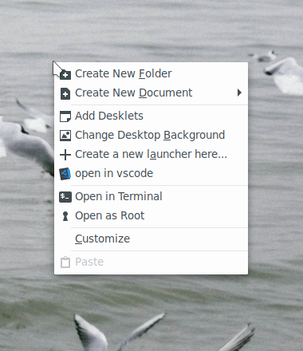

# `Open in vscode` option for Nemo



Nemo, the cinnamon DE (Desktop Environment) file manager, supports adding actions and scripts easily by adding a config file in `~/.local/share/nemo`.

So, for adding the `open in vscode` option, you just need to place the file `vscode.nemo_action` in the `actions` folder in the mentioned directory.

# Installation

Clone this repository and run:

```shell
sudo cp nemo-open-in-vscode/vscode.nemo_action ~/.local/share/nemo/actions
```

